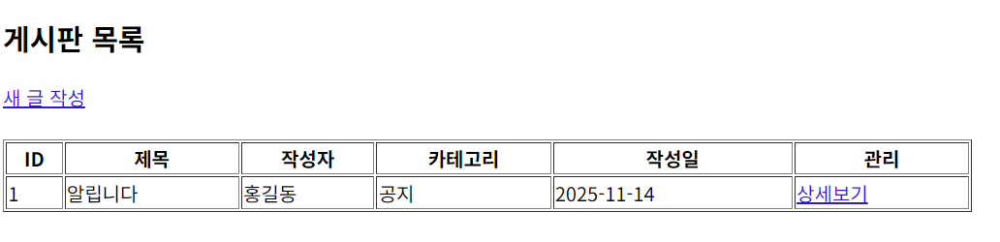
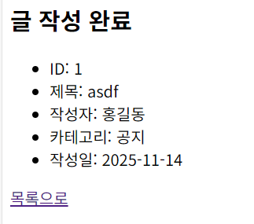
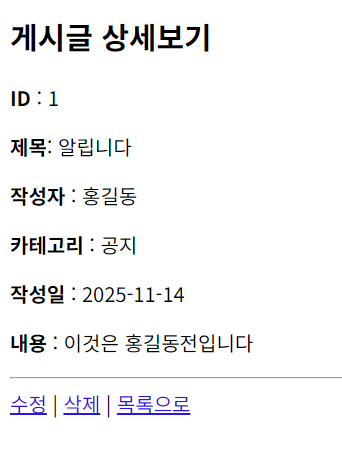
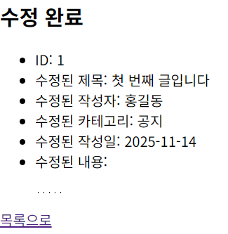
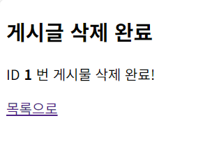

# 📷 실행 화면 캡처

## 📄 1. 목록 페이지 (list.jsp)

---

## 📝 2. 글 작성 페이지 (write.html)
.png)

---

## 📤 3. 글 작성 완료 (write_ok.jsp)

---

## 🔍 4. 상세 보기 페이지 (view.jsp)

---

## ✏ 5. 수정 페이지 (edit.html)
.png)

---

## 💾 6. 수정 완료 페이지 (edit_ok.jsp)

---

## 🗑 7. 삭제 완료 페이지 (delete_ok.jsp)
